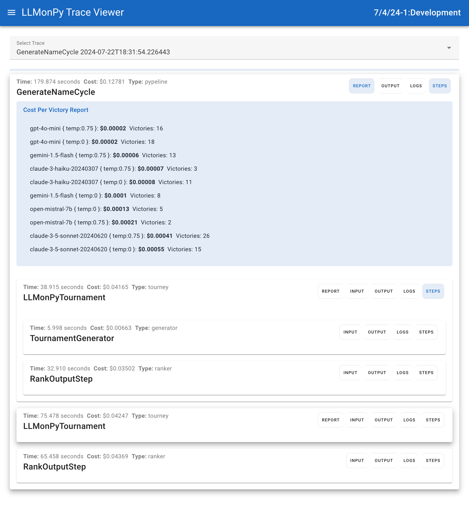

# LLMonPy

LLMonPy is a python library that aims to make it easy to build AI systems that generate "good enough" responses 99.9% 
of the time. LLMonPy makes it easy to use multiple language models (LLMs) to generate responses to prompts, to rank the
responses, and to use the best responses as examples to improve the quality of future responses.  It also generates 
question/best answer/worse answer (QBaWa) data that can be used for training models.

## Getting Started

### Setup Virtual Environment

I recommend setting up a virtual environment to isolate Python dependencies.

```bash
python3 -m venv .venv
source .venv/bin/activate
```

### Install Package

Install the package from PyPi - this takes awhile because it also installs the python clients of multiple LLMs:

```bash
pip install llmonpy
```

### Environment Variables
LLMonPy uses a lot of models, so you will probably need several API keys to use it.  On startup, it looks for these keys
and initializes the clients for associated models for the keys it finds.  The following environment variables are used:

| First Choice                | Second Choice       |
|-----------------------------|---------------------|
| `LLMONPY_OPENAI_API_KEY`    | `OPENAI_API_KEY`    |
| `LLMONPY_ANTHROPIC_API_KEY` | `ANTHROPIC_API_KEY` |
| `LLMONPY_MISTRAL_API_KEY`   | `MISTRAL_API_KEY`   |
| `LLMONPY_GEMINI_API_KEY`    | `GEMINI_API_KEY`    |
| `LLMONPY_FIREWORKS_API_KEY` | `FIREWORKS_API_KEY` |


### Testing Setup
To determine what models are available, this command will list the models that are available:

```bash
llmonpy models
```

To test basic prompting, you can use the following command:

```bash	
llmonpy prompt
```

To test the tourneys, you can use the following command (it will cost about $0.03 or less):

```bash	
llmonpy tourney
```

To test the AdaptiveICLCycle, you can use the following command (it will cost about $0.9 or less):
```bash
llmonpy cycle
```

To test [mixture of agents](https://arxiv.org/pdf/2406.04692), what I call GenerateAggregateRank (GAR) you can use 
the following command (it will cost about $0.12 or less):

```bash	
llmonpy gar
```

### Creating Prompts
Prompts are classes that inherit from the LLMonPyPrompt class.  The class defines the prompt_text and the data that is
used to render the prompt (the prompt_text is used in a Jinja2 template). The class must also define a LLMonPyOutput
nested class that defines the output of the prompt.  If the prompt is used in a tourney, the class must also define a
JudgePrompt nested class that inherits from the TournamentJudgePrompt class.

- prompt_text: Class field that is the text used for a Jinja2 template
- constructor: The constructor defines the data that is used to render the prompt
- to_dict: Method that returns a dictionary of the data that is used to render the prompt and to store the input data 
in the trace
- LLMonPyOutput: Nested class that defines the output of the prompt
- JudgePrompt: Inherits from TournamentJudgePrompt and is used to rank 2 outputs from the prompt.  The output of a JudgePrompt
is always TournamentJudgePrompt.LLMonPyOutput

You can see an example of a prompt in the [steps_prompt.py](src/llmonpy/example/steps_prompt.py) file. If a prompt is
used in an AdaptiveICLCycle, the prompt will probably include ******.  Example_list is a list of
examples of good responses.  The data are instances of the LLMonPyOutput class.

### Tourneys
Tourneys are LLMonPySteps that use the LLMonPyTournament class to have multiple LLMs generate responses to a prompt.  It
then ranks the responses by using LLM judges to compare each output against every other output.  The winner of the tourney
is the response with the most victories.  There is an example of a tourney in steps_prompt.py file.

### AdaptiveICLCycle
The AdaptiveICLCycle use a tourney to generate a list of examples of good responses.  It then re-runs the tourney with
the good responses used as examples to improve the quality of the responses.  The cycle continues until it reaches a
limit you set or the responses have stopped improving. There is an example of a cycle in steps_prompt.py file.

### GenerateAggregateRank (GAR)
The GenerateAggregateRank (GAR) is a mixture of agents that uses a list of "generator" models to generate responses a 
first round of responses.  The first rounds of responses are used as examples for the next round of responses. That process
is repeated for the number of rounds you set.  The last round of responses are ranked by a list of "judge" models.

### Trace Viewer
LLMonPy has a trace viewer that can help you understand how your pipeline is working.  To start it use this command:

```bash
llmonpy_viewer
```

The UI is at http://localhost:2304 and looks like this:<br><br>

<br><br>
The trace viewer lets you see the "Victory Report" of tourneys and cycles.  It also lets you see the input data, output data,
the logs for each step and the sub-steps of each step.  The Victory Report divides the total cost of each model's responses
by the number of victories the model had in one on one battles.  The trace data is stored in the "data" directory in your
project directory.  It is stored in a SQLite database.


### Training Data (QBaWa)
LLMonPy stores the results of all the one on one battles used to rank the responses in a tourney.  This data can be used
to fine-tune models.  It is indexed by the name of the prompt class.  To get a list of prompts with training data, use
the following command:

```bash
llmonpy qbawa_list
```

This command will return a list of prompt names.  To get the actual training data as JSON, use the following command:

```bash
llmonpy qbawa -name=<prompt_name>
```

